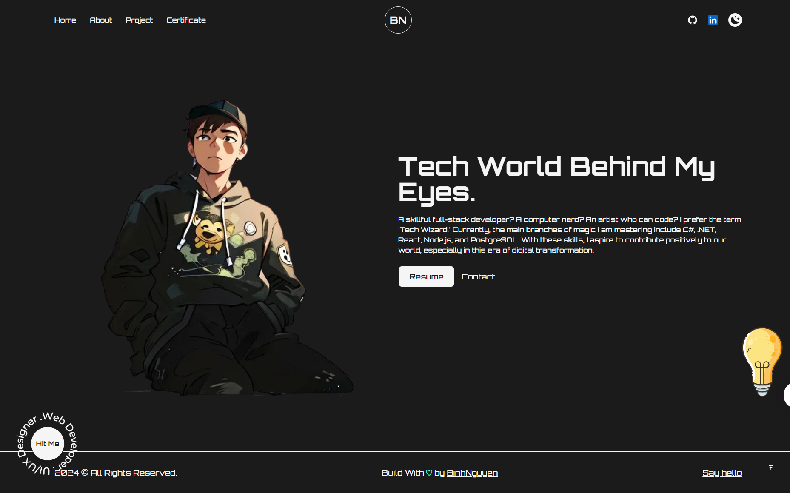
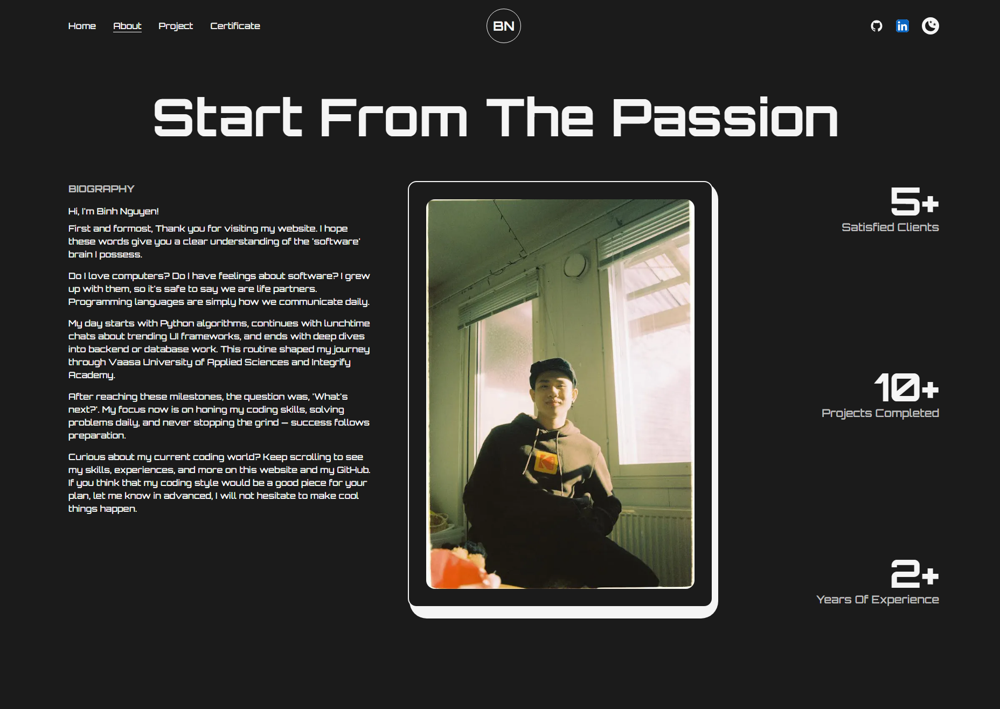
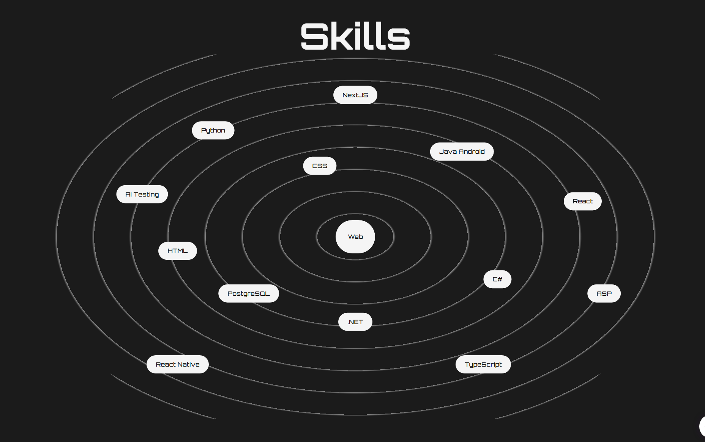
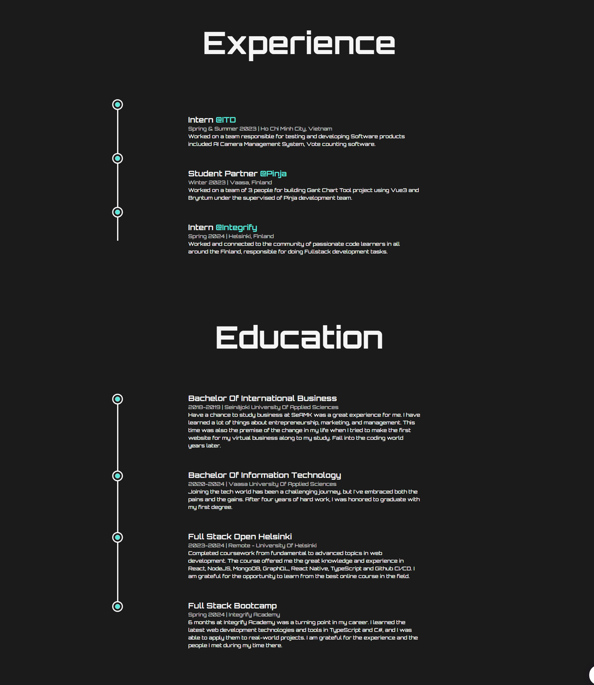
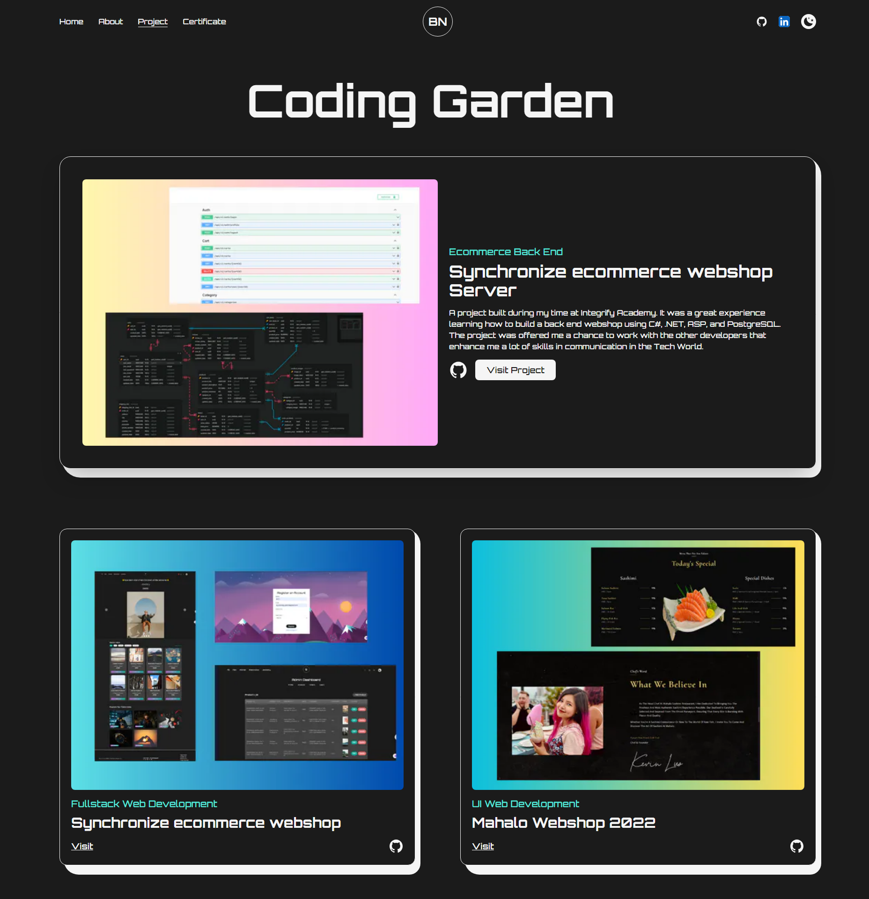
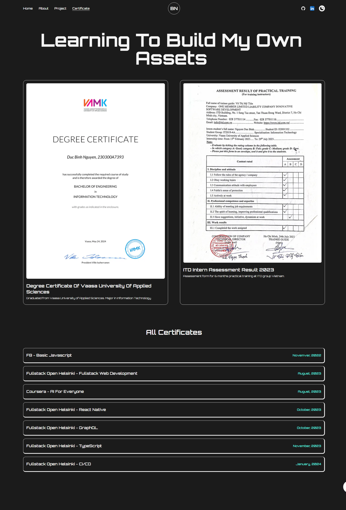

# Nguyen Duc Binh Portfolio 2024


## Project Description

Welcome to my Portfolio 2024 repository. This project showcases my skills, projects, and experiences as a developer. The portfolio is built using modern web technologies to ensure a responsive and engaging user experience.
**Link to deployed Frontend Web UI:** [Frontend](https://nguyenducbinh.vercel.app/)

## Table of Contents

- [Features](#features)
- [File/Folder Structure](#filefolder-structure)
- [Installation](#installation)
- [User Interface](#user-interface)
- [Contributing](#contributing)

## Features

- Home page with an introduction and overview.
- About section detailing personal and professional background.
- Projects section highlighting key projects with descriptions and links.
- Certificates section showcasing technical skills and proficiencies.
- Responsive design for seamless viewing on any device.
- Dark mode for enhancing User Friendly and User Accessibility Content.

## File/Folder Structure

```sh
portfolio-2024/
│
├── public/
│ ├── All-Texts/
│ │ ├── Icons.txt
│ │ └── styles.txt
│ ├── cv.pdf
│ ├── Diploma2001352.pdf
│ ├── icon.jpg
│ ├── InternAssessmentResult.pdf
│ ├── next.svg
│ ├── thirteen.svg
│ └── vercel.svg
│
├── src/
│ ├── components/
│ │ ├── hooks/
│ │ │ └── useThemeSwitcher.js
│ │ ├── AnimatedText.js
│ │ ├── Education.js
│ │ ├── Experience.js
│ │ ├── Footer.js
│ │ ├── GoToTopComponent.js
│ │ ├── HireMe.js
│ │ ├── Icons.js
│ │ ├── Layout.js
│ │ ├── LiIcon.js
│ │ ├── Logo.js
│ │ ├── Navbar.js
│ │ ├── Skills.js
│ │ └── TransitionEffect.js
│ ├── images/
│ │ ├── certificates/
│ │ ├── profile/
│ │ ├── projects/
│ │ ├── svgs/
│ │ └── circular-text.png
│ ├── pages/
│ │ ├── api/
│ │ ├── _app.js
│ │ ├── _document.js
│ │ ├── about.js
│ │ ├── certificate.js
│ │ ├── index.js
│ │ └── project.js
│ └── styles/
│   ├── globals.css
│   └── Home.module.css
│
├── .eslintrc.json
├── .gitignore
├── .hintrc
├── jsconfig.json
├── next.config.js
├── package-lock.json
├── package.json
├── postcss.config.js
├── README.md
└── tailwind.config.js
```

## Installation

1. Open your terminal and clone the repository with the following command:

   ```sh
   git clone https://github.com/tripplen23/portfolio-2024.git

   ```

2. Navigate to the project directory:

   ```sh
   cd portfolio-2024

   ```

3. Install all the packages:

   ```sh
    npm install
    # or
    yarn
   ```

4. Start the application in your local machine development environment:

   ```sh
    npm dev
    # or
    yarn dev
   ```

5. Open your browser and go to http://localhost:3000 to view the portfolio.

## User Interface

### Home page



### About page





### Project Page



### Certificate Page



## Contributing

Contributions are welcome! If you have suggestions for improvements or new features, please open an issue or submit a pull request.
